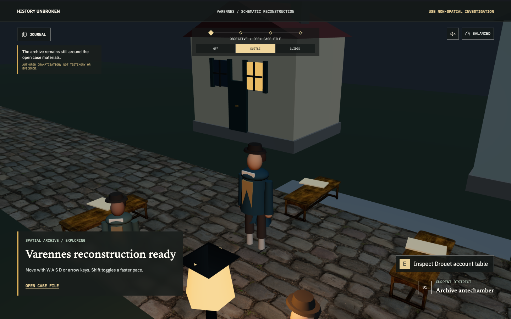
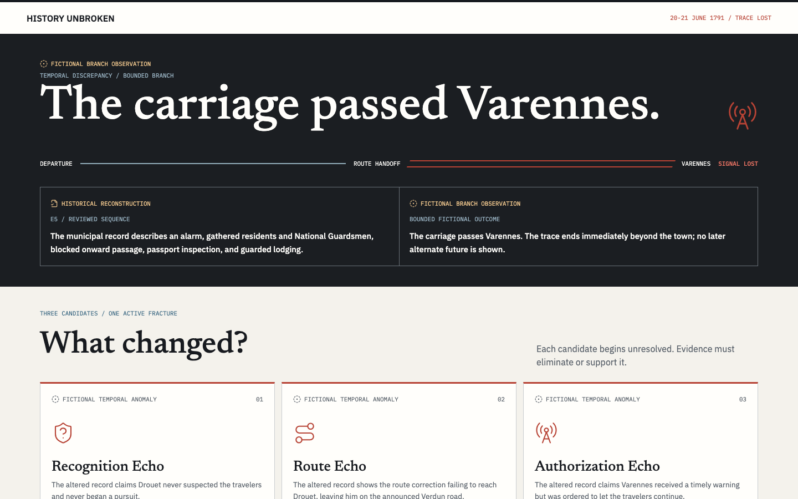
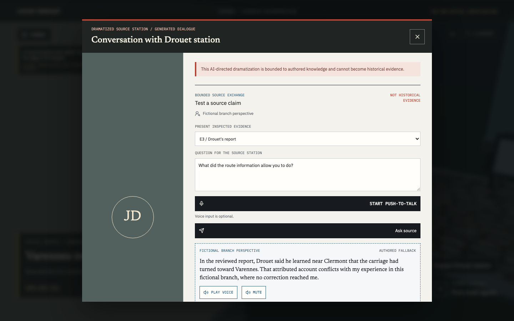
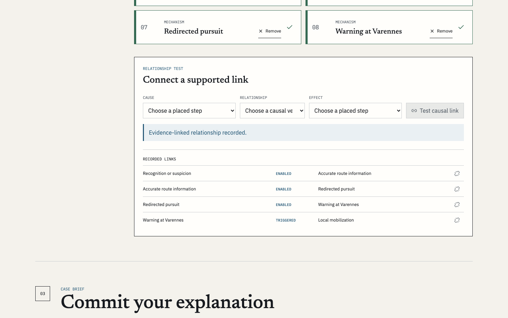
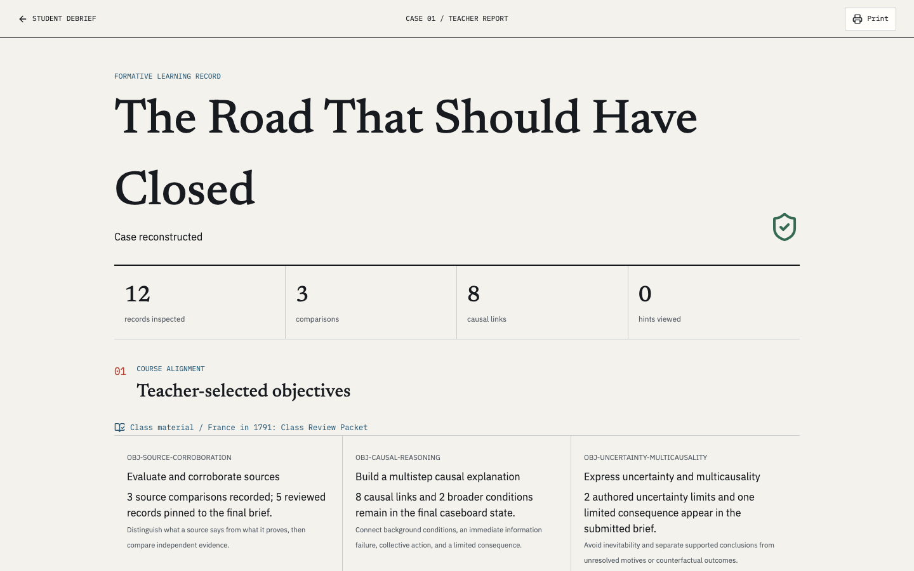

# History Unbroken

**History Unbroken: The Road That Should Have Closed** is a teacher-aligned historical mystery game where students investigate a fractured version of the Flight to Varennes, question source-bound AI characters, compare evidence, build a causal argument, and repair one altered historical link without reducing the French Revolution to a single cause.

## Product Screens











## Current Status

The complete local submission case and GPT-5.6 source-bounded layer are implemented. Historical truth, evidence, case state, and repair eligibility remain repository-owned and deterministic.

Implemented foundations include:

- a Next.js application shell and real-browser smoke test
- a versioned, source-linked Varennes case package
- strict historical-integrity and referential-integrity validation
- a pure typed case reducer with revision and phase authority
- deterministic repair eligibility independent of model output
- versioned local persistence and invalid-state recovery
- a shared browser case-session provider
- a six-step novice context primer and bounded fracture opening
- a nonlinear investigation archive with explicit source comparison
- a deterministic causal caseboard and open-form recorded Case Brief
- a source-linked repair sequence with an explicit unknown counterfactual boundary
- a final learning summary that separates validated actions, recorded prose, and historical reconstruction
- a complete Playwright path from an empty session through persisted debrief state
- generated, source-bounded exchanges for Drouet and Louis only
- static Varennes civic and Assembly reaction dossiers
- ID-only model plans whose visible historical language is rendered from authored server policy
- evidence-reaction prerequisites that prevent a character from reacting to evidence the student did not present
- provenance- and lineage-aware formative Case Brief feedback
- strict response security headers and CSP with explicit WebAssembly and GLTF blob-texture support; all AI routes use the Node.js runtime with a 40-second maximum duration
- input moderation with a 10-second timeout, bounded request schemas, in-memory route rate limiting, request cancellation, and authored no-key/provider fallbacks
- versioned presentation-only transcription and speech contracts with exact-caption HMAC authorization and a 3 MB binary response ceiling below the deployment payload limit
- course alignment `1.1.0` with a reviewed sample, pasted text, and bounded TXT/Markdown ingestion
- teacher review and explicit approval before an alignment profile can affect student-facing support
- a four-step authored hint ladder with standard, reduced-reading, and approved class-term variants
- a separate versioned learning-session envelope for support preferences, approved alignment metadata, and bounded observable event codes
- reduced-reading and reduced-motion behavior across the primer, evidence surfaces, dialogue/feedback, spatial scene, and repair sequence
- a deterministic, printable teacher report derived from validated case state and recorded interface events
- historical-integrity tests and a source-bounded model-policy evaluation corpus
- a full-bleed, four-zone grounded stylized district with articulated period-inspired figures, late-evening lighting, route travel, and deterministic DOM evidence overlays
- a strict world asset ledger covering repository-authored presentation systems and five optimized CC0 runtime files with exact hashes, project-authored license verification, modifications, and non-evidentiary limitations
- optional-asset error boundaries and procedural fallbacks so a failed prop or texture request cannot remove the historical investigation
- muted-by-default procedural ambience with explicit sound control, hidden-tab muting, and no historical-evidence authority

Task 12's staged voice runtime is implemented and locally verified: explicit push-to-talk transcription, exact-caption provider speech, browser-speech fallback, editable captions, mute/stop controls, strict media correlation, and bounded cleanup are present. Provider behavior is covered through injected gateways and browser network fixtures; a live API-key run is still required before claiming provider-level OpenAI media verification.

Phase 4 teacher alignment/accessibility and the Phase 5 grounded visual pass are implemented. The world remains explicitly schematic and non-evidentiary even though its materials, lighting, figures, motion, and props are more grounded. The browser offers the complete non-spatial route, reduced reading, reduced motion, keyboard operation, authored media fallbacks, and deterministic no-key completion. Automated axe-core checks and cross-route state, reading-mode, and keyboard-focus equivalence pass. Live-provider, formal screen-reader, physical Chromebook, deployment, unfamiliar-user playtesting, and final submission gates remain separate.

Vercel is the deployment target. No live Vercel deployment or production API credential validation has been completed. The current in-memory limiter is process-local; production still requires durable distributed edge protection such as WAF/BotID or an equivalent control.

## Local Setup

Requirements:

- Node.js 22.x
- npm 10.5.1 or newer

```bash
npm install
npm run dev
```

For provider-backed character, feedback, transcription, and speech checks, create `.env.local` from the documented server-only template and fill the required secrets:

```bash
cp .env.example .env.local
npm run dev
```

Open `http://localhost:3000`.

Server-side model configuration:

```bash
OPENAI_API_KEY=your_key_here
OPENAI_MODEL=gpt-5.6 # optional; this is the default
SPEECH_AUTHORIZATION_SECRET=replace_with_a_random_server_secret_at_least_32_bytes # server-only; required for provider speech
OPENAI_SPEECH_MODEL=gpt-4o-mini-tts # optional; this is the default
```

No API key is required to complete the case. Without one, character exchanges use clearly labeled authored fallback turns and Case Brief feedback reports that AI assistance is unavailable; deterministic repair status is unchanged.

`SPEECH_AUTHORIZATION_SECRET` is server-only and must never use a `NEXT_PUBLIC_` prefix. When absent or too short, character responses remain complete and return `speechAuthorization: null`; the browser speech fallback remains available. With both a usable secret and `OPENAI_API_KEY`, the short-lived authorization permits `/api/ai/speech` to synthesize only the exact validated visible caption. `/api/ai/transcribe` accepts bounded push-to-talk audio and returns editable, non-authoritative text.

## Verification

```bash
npm test
npm run typecheck
npm run lint
npm run build
```

Install the Playwright Chromium runtime once, then run the browser suite:

```bash
PLAYWRIGHT_BROWSERS_PATH=.playwright-browsers npx playwright install chromium
PLAYWRIGHT_BROWSERS_PATH=.playwright-browsers npm run test:e2e
```

Run the isolated classroom-hardware proxy only when port 3000 is free. This
command always builds and starts a fresh production server; it will not reuse a
development server.

```bash
PLAYWRIGHT_BROWSERS_PATH=.playwright-browsers npm run test:performance
```

The proxy forces the `classroom` graphics tier, a 1366 x 768 viewport, 4x CPU
slowdown, and Chromium DevTools' Fast 4G profile. It checks a real evidence
interaction, compressed transfer, a 10-second warm-up, and a 60-second frame and
stall sample. A physical 4 GB integrated-graphics Chromebook check is still
required before 3D can be declared the default classroom route.

The automated suites validate contracts, authorization, moderation adapters, failure handling, source closure, independent-lineage rules, teacher-alignment authority, automatic accessibility rules, cross-route state and keyboard-focus equivalence, UI integration, and the full deterministic browser path. They do not substitute for a live `OPENAI_API_KEY` smoke test, formal screen-reader review, the physical Chromebook gate, or unfamiliar-user playtesting.

Release-closure baseline `9f71cb0` passed lint, typecheck, the production build, 84 Vitest files with 554 tests, and all 33 Playwright tests. The 4x-CPU classroom proxy passed at 36 FPS median, 35 FPS p10, 3,980.5 ms to the first interactive archive, and a nonblank canvas with measured player movement. Automated accessibility checks do not substitute for formal screen-reader review.

Generate the eight submission screenshots from a fresh production build and a real deterministic case session:

```bash
npm run capture:screenshots
```

The captures are written to `docs/assets/screenshots/`. Without a configured live-provider smoke flag, generated-character and Case Brief captures visibly use the authored no-key fallback. Recapture those provider-dependent frames only after a successful live smoke test.

## Product Thesis

This is not compelling because students can chat with Louis XVI. It is compelling because flexible AI dialogue is embedded inside an authored evidence system that makes historical reasoning observable, playable, and assessable without allowing the model to determine historical truth.

## Target Experience

- Category: Education
- Target student: Grade 10 World History student studying the French Revolution
- Runtime: 10-15 minutes
- Case: The Flight to Varennes, June 1791
- Core mystery: a bounded temporal fracture appears somewhere in the recognition-to-detention chain; the student compares fixed fictional branch observations with reviewed history to identify the active link among three equally labeled anomaly candidates
- Student goal: identify the altered causal link, support the claim with evidence, explain why the arrest mattered, and avoid single-cause history
- Teacher support: implemented optional course alignment for vocabulary, authored hints, selected learning objectives, accessibility preferences, and deterministic reporting

## Documentation

- [AGENTS.md](AGENTS.md) - project rules for historical integrity, AI authority, engineering, and parallel agents
- [CODEX_MASTER_BRIEF.md](CODEX_MASTER_BRIEF.md) - controlling instruction brief for the build
- [docs/PRODUCT_SPEC.md](docs/PRODUCT_SPEC.md) - full product, gameplay, and learning specification
- [docs/DESIGN_SYSTEM.md](docs/DESIGN_SYSTEM.md) - archival control-room visual system and accessibility rules
- [docs/WIREFRAMES.md](docs/WIREFRAMES.md) - critical interaction layouts and responsive behavior
- [docs/CONTEXT_AND_CURRICULUM_CANON.md](docs/CONTEXT_AND_CURRICULUM_CANON.md) - novice-safe context and teacher-alignment rules
- [docs/CASE_CANON.md](docs/CASE_CANON.md) - immutable case facts, mystery solution, characters, evidence, and causal graph
- [docs/ANSWERABILITY_MATRIX.md](docs/ANSWERABILITY_MATRIX.md) - where every required conclusion is taught or discovered
- [docs/REPAIR_GATE_TRACEABILITY.md](docs/REPAIR_GATE_TRACEABILITY.md) - deterministic gate-to-source, control, state, and test mapping
- [docs/HISTORICAL_SOURCES.md](docs/HISTORICAL_SOURCES.md) - source ledger and verification gates
- [docs/ARCHITECTURE.md](docs/ARCHITECTURE.md) - technical architecture and deterministic/model boundaries
- [docs/AI_CONTRACTS.md](docs/AI_CONTRACTS.md) - structured model contracts and authority limits
- [docs/IMPLEMENTATION_ROADMAP.md](docs/IMPLEMENTATION_ROADMAP.md) - phases, schedule, testing, and definition of done
- [docs/DEMO_SCRIPT.md](docs/DEMO_SCRIPT.md) - three-minute demo storyboard
- [docs/BUILD_LOG.md](docs/BUILD_LOG.md) - Codex collaboration log

## High-Level Architecture

The current implementation uses:

- Next.js
- TypeScript
- Tailwind CSS
- Server-side OpenAI API calls
- GPT-5.6 for selecting constrained character-response units and formative Case Brief classifications
- Zod-validated structured outputs
- Authored case data in JSON
- Deterministic case-state logic
- separate local browser persistence for deterministic case state and the learning-session support/reporting envelope
- Vercel deployment target; live deployment and credentials remain unverified

The model never writes visible historical prose, directly changes application state, or affects repair eligibility. It selects reviewed IDs, exact student-text spans, and, for course alignment, exact terms tied to server-created packet segment IDs. The server validates those selections and renders or retains only authorized authored text and short class-material references. The teacher report is deterministic; no report-narration model is used.

## Teacher Alignment And Accessibility

- `/teacher` provides objective selection, sample/paste/file inputs, reading/motion/guidance preferences, an alignment review, and explicit approval.
- `/api/ai/course-alignment` accepts versioned bounded JSON and returns a pending-review, `alignment_only` profile. With no API key or invalid model output, deterministic term matching preserves the workflow.
- `/teacher/report` builds a printable formative report from final validated case state, approved objectives and packet references, support settings, and bounded observable event codes.
- Approved support changes appear in the primer, authored hint ladder, evidence overlays, generated-character authored variants, Case Brief feedback, the 3D presentation, repair, and debrief/report surfaces. Evidence, solution requirements, and repair eligibility remain identical.

The secure first phase supports the reviewed sample, pasted text up to 40,000 characters, and UTF-8 TXT or Markdown files up to 64 KB. PDF and DOCX are intentionally unsupported because the repository does not yet contain a hardened binary extraction/OCR pipeline with bounded pages, embedded objects, decompression, and cleanup. Pretending those formats were safely supported would expand the upload attack surface and make extracted text less auditable.

For arbitrary text, the server creates bounded segments and permits a model plan to name only reviewed objective/concept/boundary IDs plus an existing segment ID and an exact packet substring. The server drops mappings that do not resolve to those exact segments. This is required because the raw packet is not retained: the persisted profile keeps a SHA-256 digest and short authorized excerpts/references, not the original upload or pasted text.

## Privacy and Safety Defaults

- No student accounts for the MVP
- No student names, demographics, or personal profiles
- No student note uploads
- Anonymous local session identifiers
- Raw pasted/uploaded course packets are processed transiently and are not stored in local persistence
- Approved alignment profiles retain only a digest, reviewed IDs, exact short excerpts/terms, references, limitations, and approval metadata
- Teacher reports describe observable reasoning, not personality or ability
- Uploaded teacher materials are treated as untrusted data
- Fictional, reconstructed, verified, contested, and class-provided materials are visibly labeled

## Important Non-Goals

The MVP will not include:

- Multiple playable mysteries
- Automatically generated historical mysteries
- A general teacher authoring platform
- A definitive alternate-history simulation
- Student accounts or LMS integration
- Unconstrained real-time speech-to-speech characters
- Open-web research during gameplay
- Vector database search over full textbooks
- Automated high-stakes grading

## Development Authority

`AGENTS.md` and the approved case documents govern implementation. Within the machine-readable package, `solution` is the sole repair authority; `repairGates` is source-linked traceability metadata only. No commit or push is made without explicit user approval.
